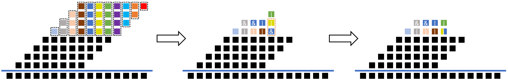

# Approximate Multiplier by HEAM


## What's HEAM?

 - **HEAM** is a general optimization method to generate high-efficiency approximate multipliers for specific applications.
 - This project contains an 8x8 unsigned approximate multiplier based on HEAM for Deep Neural Network (DNN) accelerators and the corresponding Design Compiler(DC) script. Besides, the exact WallaceTree multiplier is included for comparison.


## Optimization Procedure of the 8×8 Unsigned Approximate Multiplier



## How to compile them?

**Make sure that you have installed Design Compiler(DC) and prepared your library files.**

### compile approximate_multiplier.v

- step 1: set `TOP_LEVEL`, `all_src`, and `TOP` in `scripts/top.tcl` at line 1, line 11, and line 15 respectively:
```   
set TOP_LEVEL approximate_multiplier
set all_src "approximate_multiplier.v"
set TOP approximate_multiplier
```

 - step 2: run commands in terminal:
```
dc_shell
source scripts/top.tcl
```

### compile wallacetree.v

- step 1: set `TOP_LEVEL`, `all_src`, and `TOP` in `scripts/top.tcl` at line 1, line 11, and line 15 respectively:
```   
set TOP_LEVEL wallacetree
set all_src "wallacetree.v"
set TOP wallacetree
```

 - step 2: run commands in terminal:
```
dc_shell
source scripts/top.tcl
```


## Experiments of the Approximate Multiplier and the Exact WallaceTree multiplier on Design Compiler(DC) in 3Ghz with a 7-nm Predictive Process Design Kit (PDK) Called the ASAP7 PDK[1]


|         |   Ours  | WallaceTree | Reduction |
| :-----: | :-----: | :-----: |  :-----: | 
| Area ( μm * μm ) | 17.52516 | 42.98184 | 59.23% |
| Power ( μW )  | 76.2003 | 151.9432 | 49.85% |


## Future
1. add several reproduced approximate multipliers for comparison;
2. add DNNs accelerators results.

## Reference
[1] Clark, Lawrence T., et al. "ASAP7: A 7-nm finFET predictive process design kit." Microelectronics Journal 53 (2016): 105-115.